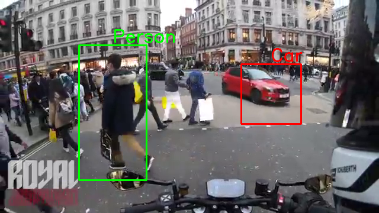
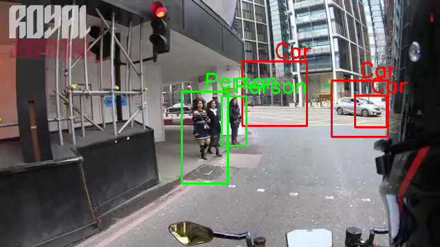
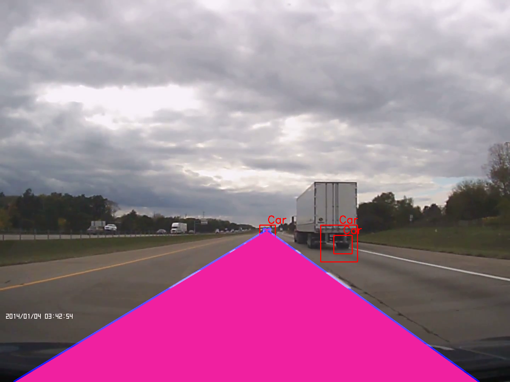

# haar_vehicle_and_pedestrian_detection
Haar cascade for detecting vehicles and pedestrians in videos using Python

## Installation

Clone the repository. Install all requirements using the following line.

```
pip install -r requirements.txt
```

## Usage

Use the classifier by running the [scr/main.py](src/main.py) file using the default videos [pedestrians and cars detection](videos/ped.mp4) or [lane detection](videos/test.mp4). You can also specify the path to a specific video using the following line.

```
python src/main.py -v <path to video file>
```

Or you can import the classifier in your code by using:

```
from src.main import Classifier

classifier = Classifier(path_to_video_file)
classifier.detect()
```

## Examples
<div>
  <p align="center">
    
  </p>
  <p align="center">
    
  </p>
  <p align="center">
    
  </p>
</div>
